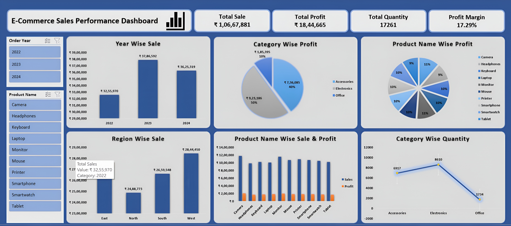

# E-commerce-Sales-Performance-Dashboard-using-Microsoft-Excel
This project analyzes an Ecommerce Sales dataset containing over 3,500+ transactions (2022–2024) using Microsoft Excel. The objective was to transform raw sales data into an interactive dashboard that provides meaningful business insights for better decision-making.

# Dashboard Preview

## Dashboard

# 1. Introduction to My Dataset
- Data Source & Volume: The Project Analyses an Ecommerce Sales Dataset consisting of over 3,500 rows of transactional records spanning three consecutive years (2022–2024).
- Key Attributes: The Dataset contains critical business variables including Order Date, Product Name, Category (Office, Accessories, Electronics), Region (North, East, West, South), Quantity, Sales, and Net Profit.

# 2. Why Choose This Project Using Excel?
- Industry Standard: Excel remains one of the most powerful and widely used tools for Business Intelligence and quick data prototyping.
- Advanced Data Ingestion: It allowed me to demonstrate robust ETL (Extract, Transform, Load) features that mimic enterprise-level data cleaning pipelines.
- Dynamic Calculations: Excel’s specialized analytical engine helps in processing thousands of rows efficiently to extract immediate business metrics.

# 3. Project Development Steps & Technical Points
## Step 1: Data Ingestion & Transformation (Power Query)
- Used Power Query (Get Data) to connect directly to the raw dataset, building a dynamic workflow that refreshes automatically.
- Cleaned missing values, established strict date-type formatting for 'Order Date', and standardized numeric types for Sales and Profit.

## Step 2: Metrics Architecture (KPI Cards)
- Developed high-level executive cards using Pivot Table logic to showcase essential business health indicators instantly: Total Sales, Total Net Profit, and Total Quantity Sold.

## Step 3: Interactive Visualizations (Pivot Charts)
- Sales Trend over Time: Designed a 2D Line Chart to track monthly and yearly sales trajectories.
- Regional Contribution: Created a Donut Chart highlighting the market share of different geographical zones.
- Product & Category Profitability: Built a Clustered Bar Chart sorting the top-performing products based on net profitability.
- Sales vs. Profit Margin: Engineered a Combo Chart (Column + Line with Secondary Axis) to evaluate the correlation between high revenue generation and actual profit retention.

## Step 4: Interactivity & User Experience (UX)

- Integrated Dynamic Slicers for Region and Category.
- Configured Report Connections across all backend tables to enable seamless, one-click cross-filtering.
- Cleaned the user interface by hiding default chart buttons and removing worksheet gridlines for a modern, software-like layout.

# 4. Conclusion
- Actionable Insights: This project successfully highlights how data visualization can pinpoint exactly which products and regions are driving profitability and where cost optimizations are required.
- Business Value: Turning raw spreadsheet rows into an interactive interface allows stakeholders to make fast, data-driven decisions without looking at complex tables.

# 5. Summary to End Project
- In summary, this portfolio project allowed me to practically apply core Data Analytics principles—ranging from data cleansing and ETL via Power Query to advanced data modeling, data visualization, and dashboard UX design.
